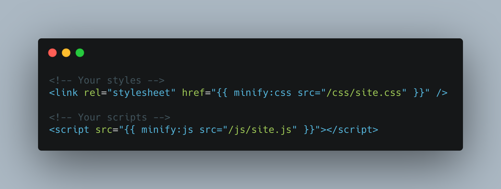

# Minify
> Minify your site's CSS & JavaScript when they change

This addon minifies your site's CSS & JavaScript when they change. All you need to do is change the code that pulls in your assets.



## Installation

1. Install via Composer - `composer require doublethreedigital/minify`
2. Replace your style and script paths with the Minify replacements

## Usage

Minify only minifies the files, it doesn't handle your build process for you. We'd recommend using [Laravel Mix](https://laravel.com/docs/7.x/mix#introduction) for that.

### CSS

To pull in a stylesheet, use the `minify:css` tag. Remember to include the `src`, the value of which should be the relative path to your CSS file from your project's `public` directory.

```antlers
{{ minify:css src="css/site.css" }}
```

This above example would minify the existing `public/css/site.css` file, save it and serve it to the user.

### JavaScript

To pull in a script, use the `minify:js` tag. Like the CSS tag, remember to include the `src` parameter, the value of which should be the relative path to your JavaScript file from your project's `public` directory.

```antlers
{{ minify:js src="js/site.js" }}
```

> Minify has been known to have issues with some ES6 JavaScript stuff, please verify your site works before shipping to production.

### Inline assets

If you don't want the minified version of your assets to be stored in a file, you can get the contents of the minification inline.

```html
<!-- It works for both... styles -->
<style>{{ minify:css src="css/site.css" inline="true" }}</style>

<!-- And scripts -->
<script>{{ minify:js src="js/site.js" inline="true" }}</script>
```

### Caching
This addon makes use of caching so that it doesn't have to re-minify your assets during each page load. Sometimes this can cause issues so we've built a command that clears everything for you.

```
php please minify:clear
```

You may also wish to run `php artisan cache:clear` at the same time.

## Resources

* [Official Support](https://doublethree.digital)
* [Unofficial Support (#3rd-party)](https://statamic.com/discord)

<p>
<a href="https://statamic.com"></a>
<a href="https://packagist.org/packages/doublethreedigital/minify/stats"></a>
</p>